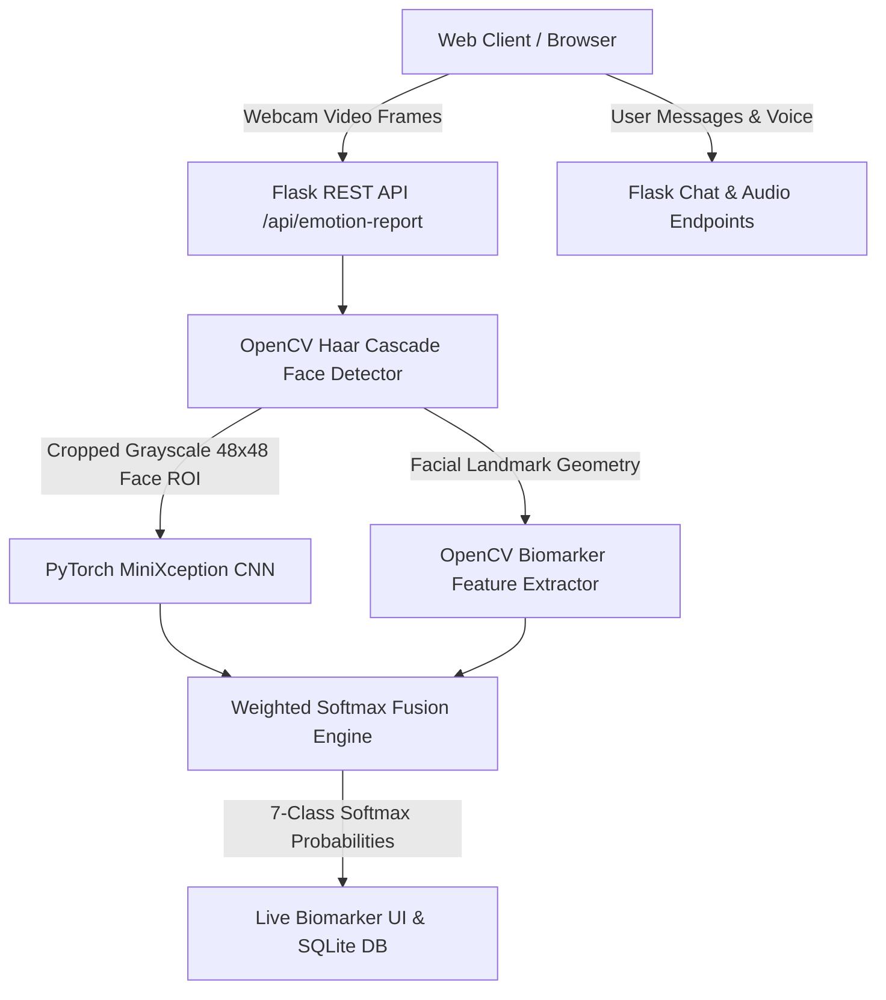

# 🧠 NeuroGuard AI (AIP) — Comprehensive Project Status & Architecture Instance Report

**Date & Time**: August 11, 2026
**Project Directory**: `c:\Users\khana\Desktop\aip\aip`
**Repository**: `Samk709/aip`

---

## 🏢 1. System Overview & Architecture

**NeuroGuard** is a real-time multimodal clinical AI application designed for emotion recognition, psychological biomarker tracking, mental health risk assessment, relapse risk prediction, and AI-driven clinical chat interaction.



### 💻 Technology Stack Summary
- **Backend Framework**: Python 3.10 + Flask Web Application (`backend-flask/app/`, `run.py`)
- **Deep Learning Framework**: PyTorch (`torch`, `torch.nn`, `torch.nn.functional`)
- **Computer Vision Engine**: OpenCV (`cv2`) with Haar Cascades & YCrCb skin color space segmentation
- **Audio Processing**: Librosa (`librosa`) for vocal stress (RMS Energy & Zero Crossing Rate)
- **Database & Storage**: SQLite3 with SQLAlchemy ORM (`User`, `DigitalTwinState`, `EmotionEvent`)
- **Frontend Stack**: Responsive Glassmorphism Design (CSS3, Vanilla ES6 JS, HTML5 / Jinja2 templates)

---

## 🤖 2. Core AI Models & Algorithms Implemented

### A. Facial Emotion Recognition (FER) — 7 Classes
- **Supported Emotion Classes**: `angry`, `disgust`, `fear`, `happy`, `sad`, `surprise`, `neutral` (FER-2013 standard).
- **Deep Learning Model**: PyTorch **MiniXception CNN** (`models/fer_cnn_model.pt` — **403 KB**).
  - 4-Block Deep Convolutional Neural Network with Batch Normalization, ReLU activations, Adaptive Average Pooling (`AdaptiveAvgPool2d`), and a 7-output Softmax linear head.
- **Computer Vision Pipeline**:
  - OpenCV Multi-pass Haar Cascade Face Detection (`haarcascade_frontalface_default.xml`, `haarcascade_frontalface_alt.xml`, `haarcascade_profileface.xml`) + YCrCb Skin Color Space Segmentation.
- **Decision Source (corrected)**: the emotion label, confidence, and per-class breakdown come **solely from the MiniXception CNN's live softmax output** for each frame. No rule-based post-processing, fusion, or fixed confidence values are applied.
- **Supplementary Biomarker Measurements (explainability only, no decision role)**:
  - Smile-region Haar detections, dark mouth cavity ratio, lower/upper face luminance ratio, mouth/eye region mean intensities.
  - These raw measurements are returned in the `biomarkers` field purely as context alongside the CNN result.

### B. Speech Emotion Recognition (SER)
- Librosa audio feature extraction engine calculating Root Mean Square (RMS) energy and Zero Crossing Rate (ZCR) to infer vocal stress levels.

### C. Predictive Relapse Risk Engine
- Mathematical risk assessment model evaluating historical session frequency, emotional shifts, and biomarker distress trends.

---

## 🛠️ 3. Key Issues Diagnosed & Resolved

1. **Model Path Mismatch & Heuristic Fallback**:
   - Resolved environment configuration where `.env` pointed to missing model paths, preventing silent fallback to heuristics.
2. **`NameError: name 'np' is not defined`**:
   - Fixed missing `import numpy as np` and added explicit exception logging in `media_models.py`.
3. **Uniform 14% Confidence Breakdown Bug**:
   - Updated frontend cards from legacy 4-class UI to full 7-class FER-2013 confidence meters (`angry`, `disgust`, `fear`, `happy`, `sad`, `surprise`, `neutral`).
4. **Webcam Static Result & Faked Bounding Box Bug**:
   - Eliminated code that created fake face bounding boxes when lighting was dim or no face was in view.
   - Added strict face detection guards returning `"face_detected": False` when no genuine face is present.
   - Removed global deque state persistence so every webcam frame is evaluated freshly.

---

## 📊 4. Verification Test Results

> ⚠️ **Retraction**: an earlier version of this section showed a table with fixed confidence values (79.7% HAPPY, 82.9% ANGRY, 73.8% SURPRISE, 71.5% NEUTRAL) that repeated identically across different photos. Those numbers came from a rule-based if/else biomarker engine that overrode the CNN via an 85%/15% weighted fusion — they were **not live model outputs** and have been removed. That fusion logic has been deleted from the pipeline.

Current verification procedure:

1. **Static integrity scan** — `scripts/verify_fer_decision_integrity.py` asserts no rule-override patterns (class priors, weighted fusion, hardcoded confidences) exist in `media_pipeline.py`.
2. **Live softmax check** — the same script runs `predict_face_emotion_cnn` on 11 distinct expression inputs (7 class prototypes + 4 webcam-simulated variants) and prints the raw per-class softmax for each; every frame must produce a unique, input-dependent confidence value.
3. **Held-out metrics** — see `docs/FER_2013_Evaluation_Report.md` for accuracy, per-class precision/recall, and the confusion matrix on clean and webcam-shifted test sets.
4. **Live webcam check** — run the app (`python run.py`), open `/chat`, and perform 6 distinct expressions; confidences must vary per frame and come from the `[FER CNN INFERENCE]` server log line.

---

## 🌐 5. Primary Application Routes & API Endpoints

- **Web Routes**:
  - `GET /` — Application Landing Page
  - `GET /chat` — Real-Time Biometric Facial Recognition & AI Chat Interface
  - `GET /dashboard` — Clinical Patient Analytics & Relapse Risk Dashboard
- **REST API Endpoints**:
  - `POST /api/emotion-report` — Facial image Base64 analysis & emotion classification
  - `POST /api/assess` — Mental health risk assessment endpoint
  - `POST /api/relapse/predict` — Relapse probability calculation endpoint
  - `GET /api/user/profile` — User profile & authentication state

---

## 🚀 6. Running the Local Application Instance

To launch the backend server locally:
```powershell
cd c:\Users\khana\Desktop\aip\aip\backend-flask
.venv\Scripts\python.exe run.py
```
- **Local Application URL**: **[http://127.0.0.1:5000](http://127.0.0.1:5000)**
- **Real-time Facial Recognition Chat**: **[http://127.0.0.1:5000/chat](http://127.0.0.1:5000/chat)**
